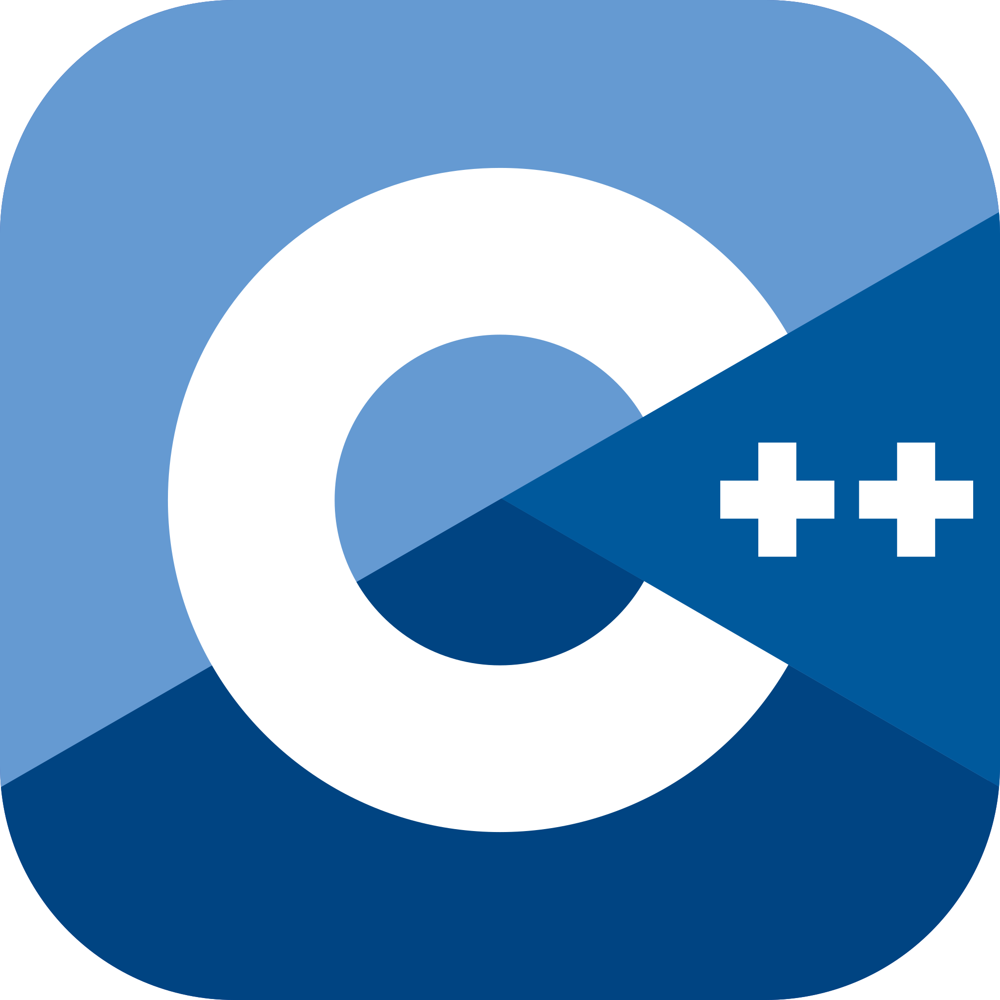
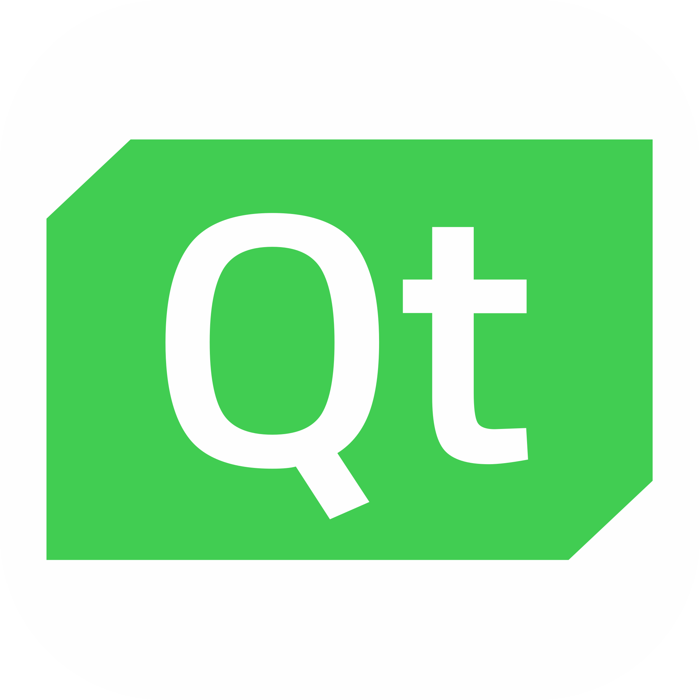
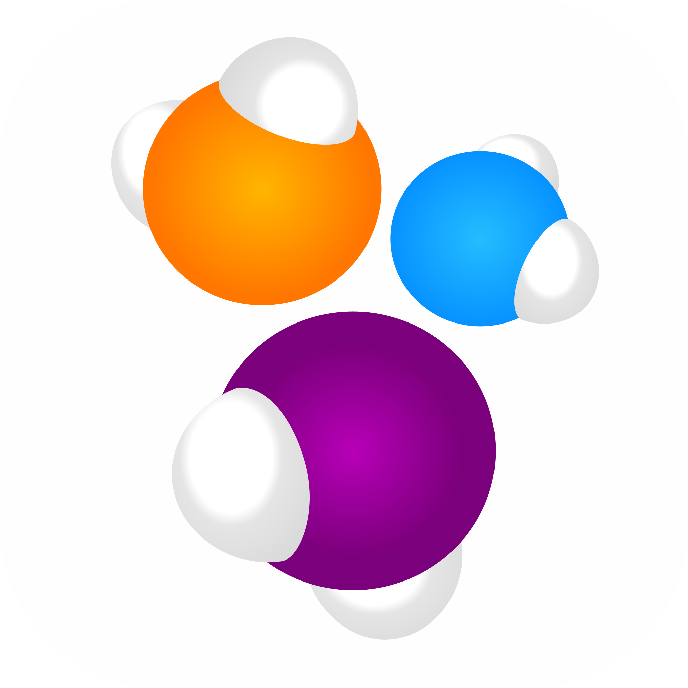
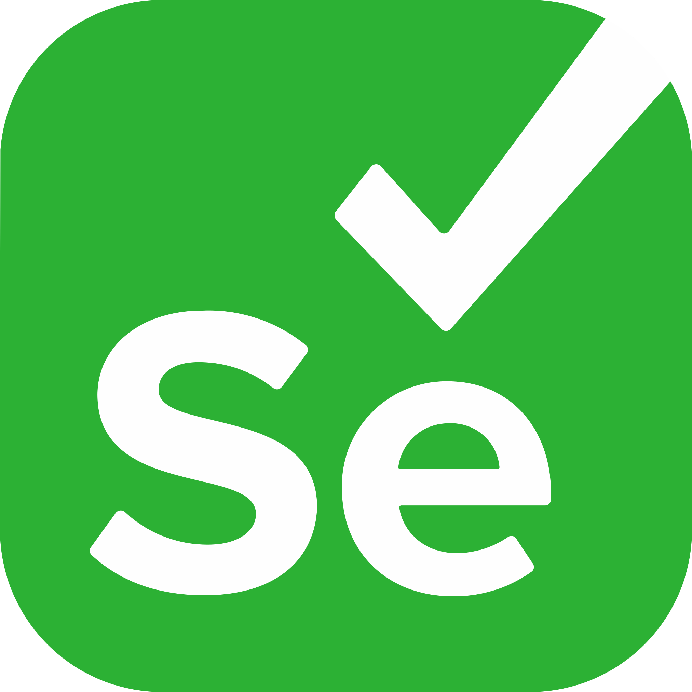
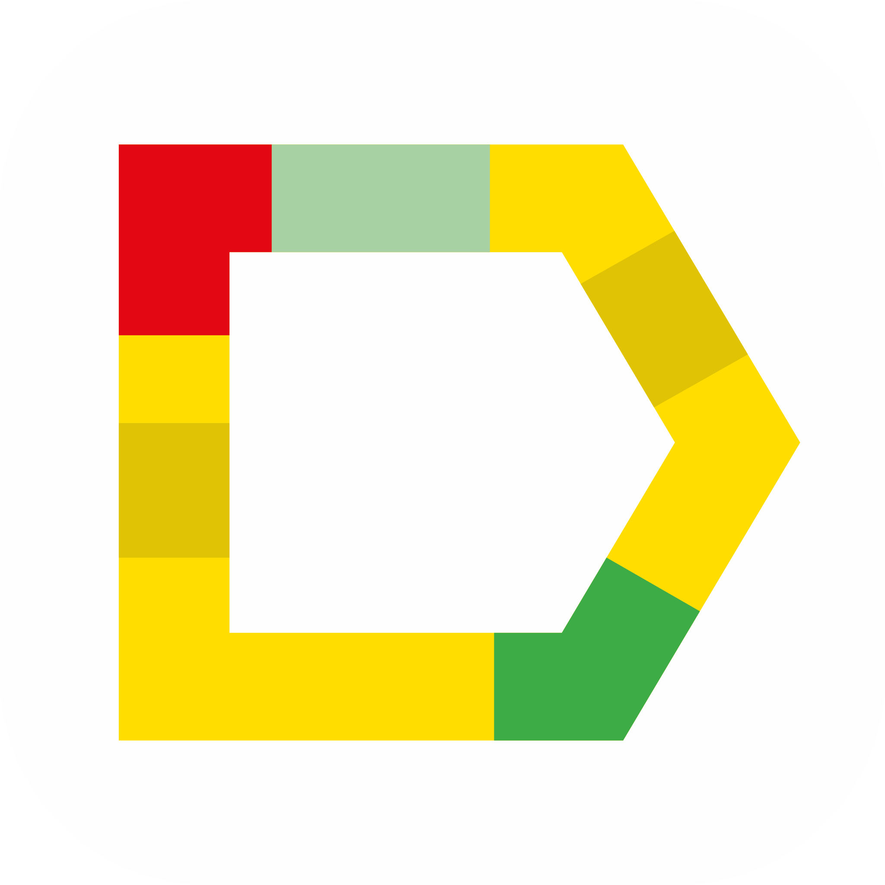
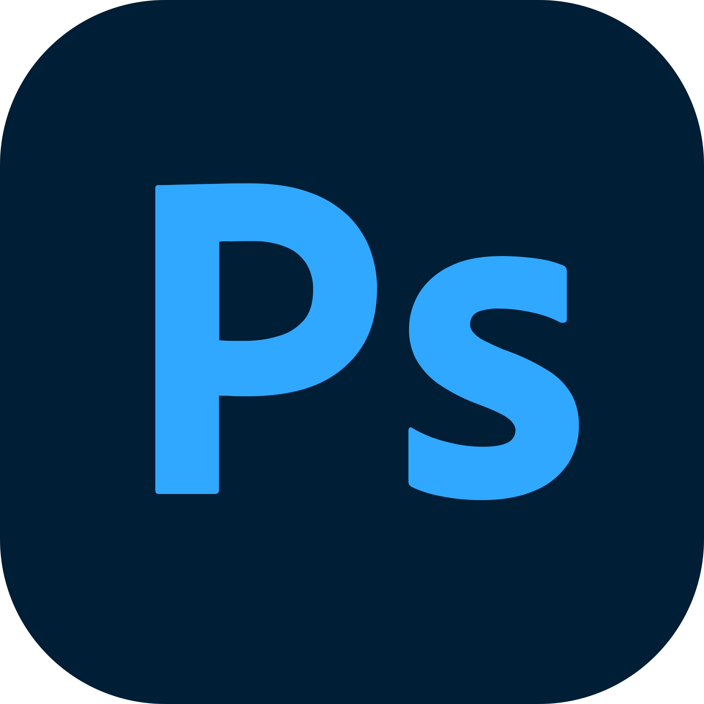
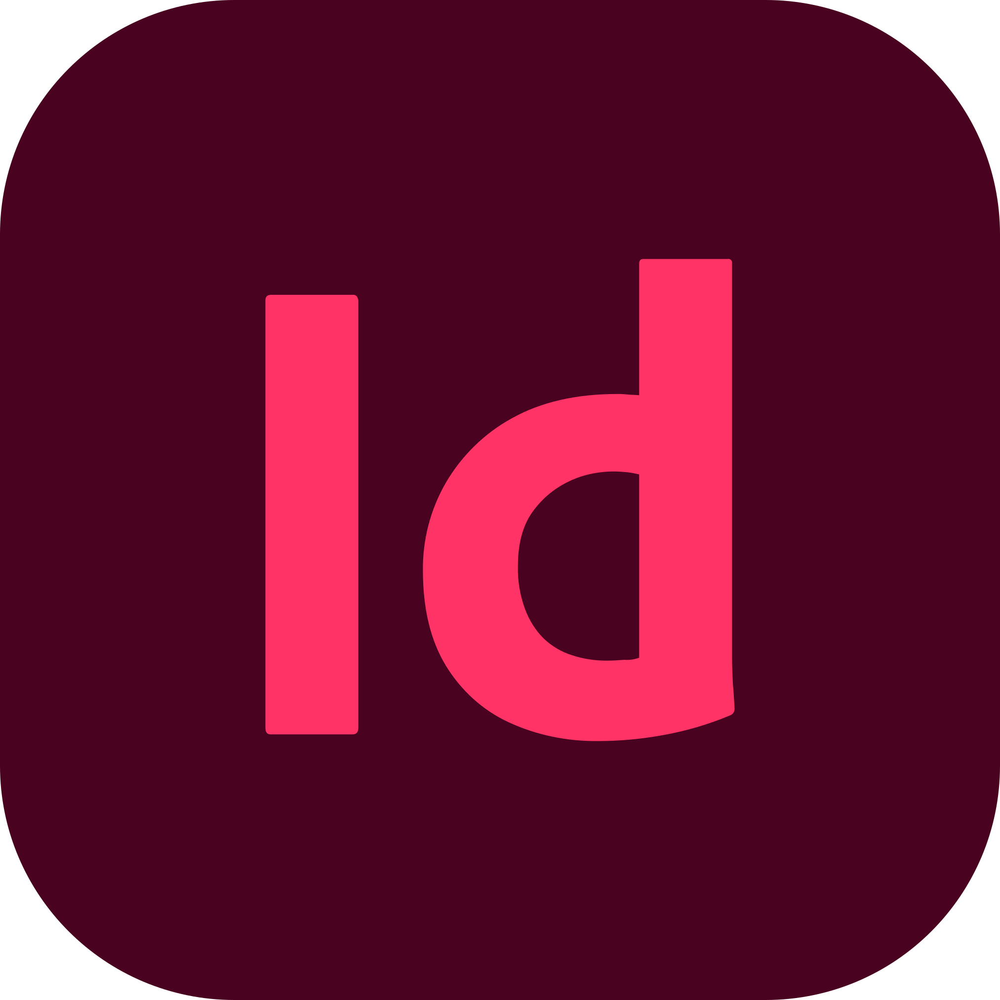
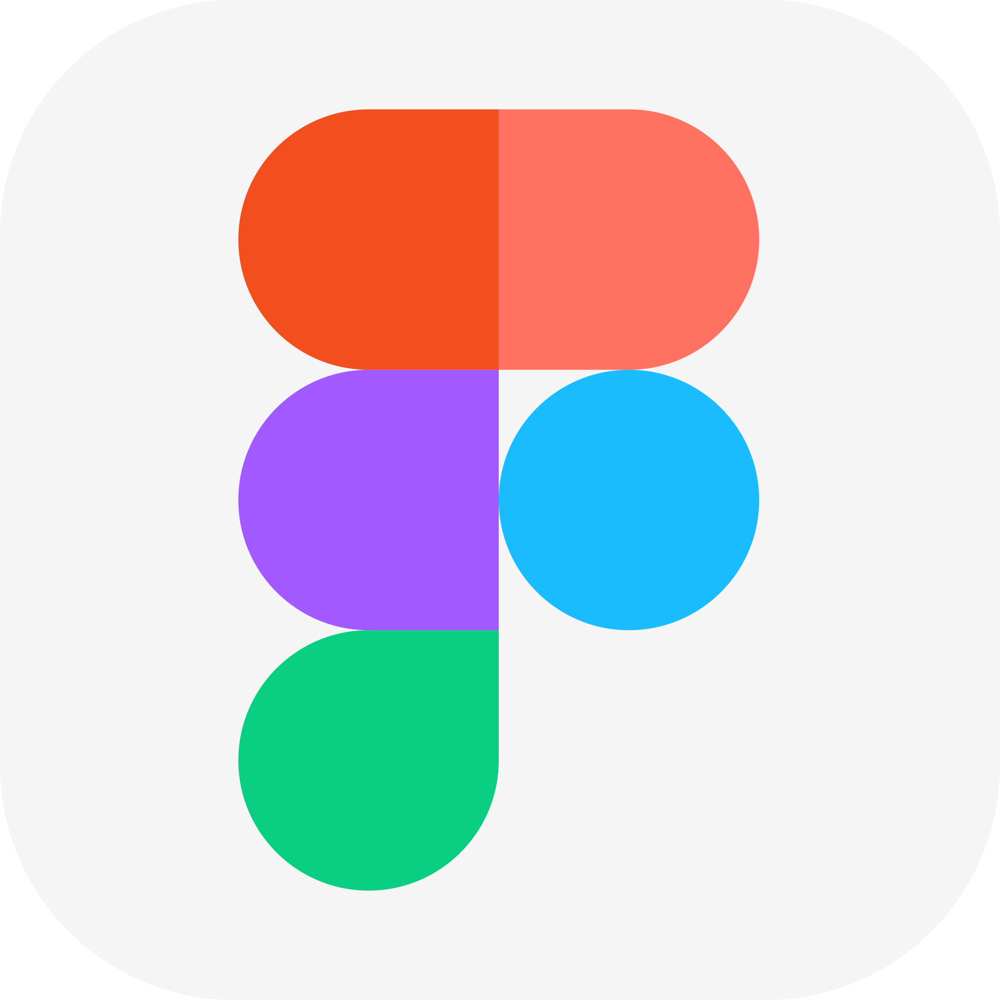

# Hi there, I'm Iana 

## About Me:

- 🌱 I’m currently learning **QA, Java** and studying in [**School 21**](https://21-school.ru/)
- 🌍 Languages: **Русский**, **English** (B1-B2),  **한국어** (~3-4급)
- ⚡ Fun fact: I have a Bachelor's Degree in Architecture

## Languages & Tools I use:

 

## Let's get connected:

